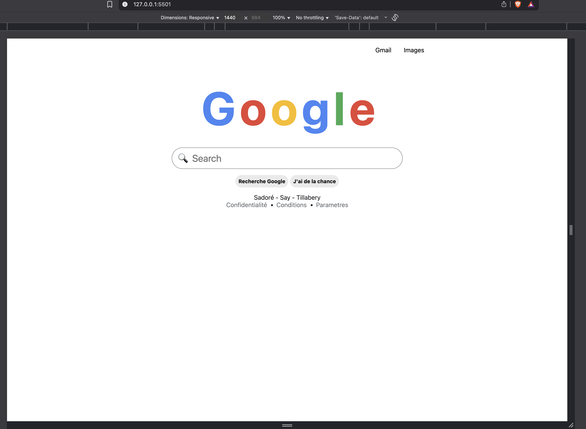
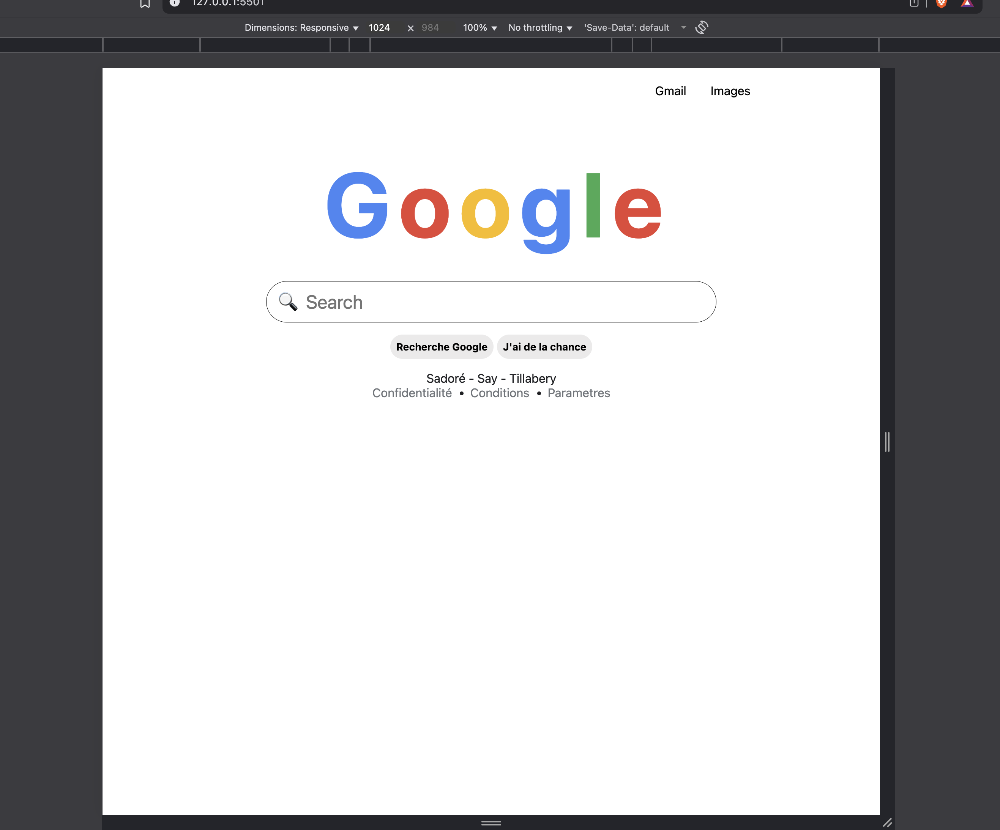
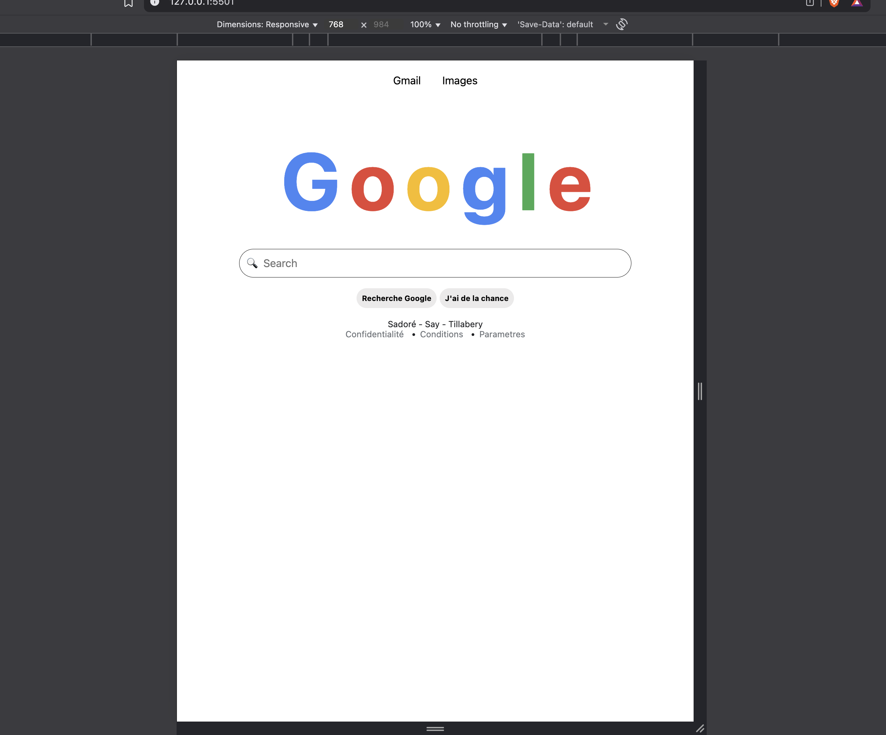
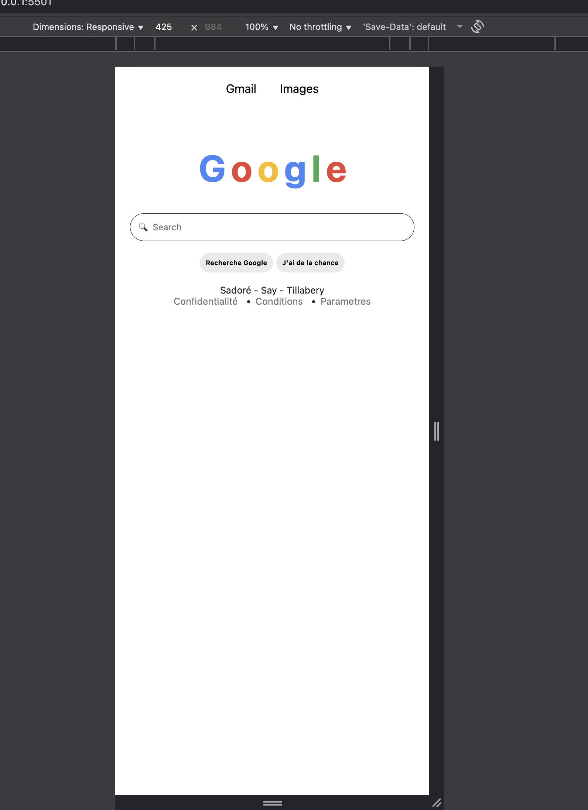
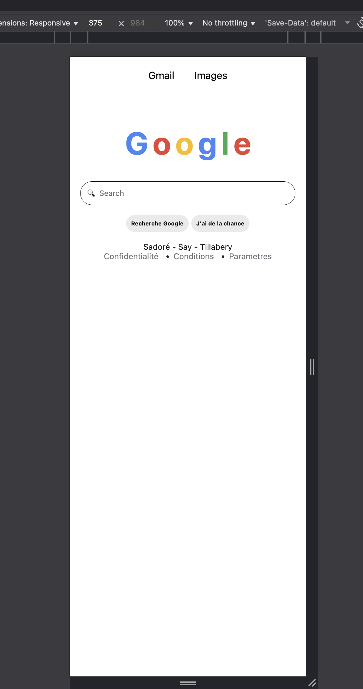
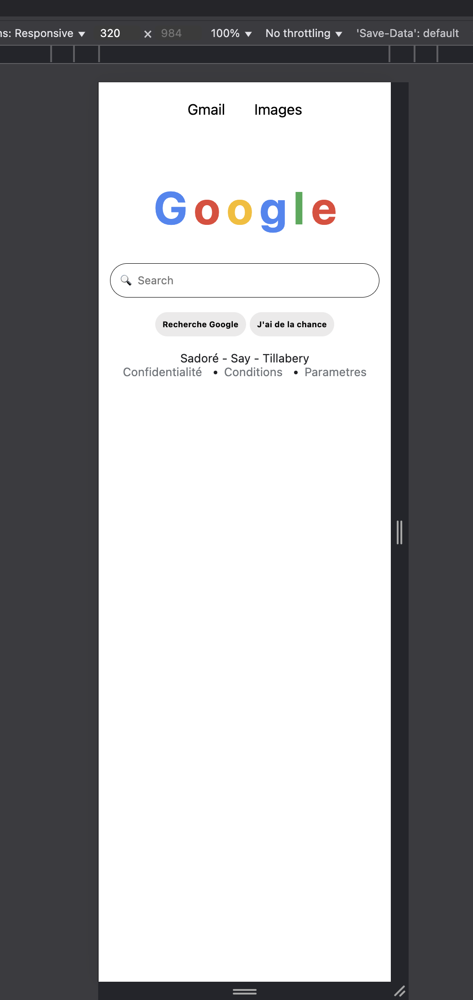

# Objectif du projet

Ce projet consiste à recréer la page d’accueil de Google en utilisant uniquement les technologies HTML et CSS. L’objectif est de s’exercer à la structuration d’une page web, à l’utilisation des balises sémantiques, à la mise en forme avec CSS et à la reproduction fidèle d’une interface célèbre.

Structuration de la page avec les balises ```<header>```, ```<main>``` et ```<footer>```.
Affichage du logo Google stylisé avec du texte.
Création d’une barre de recherche accessible et de boutons d’action.
Ajout d’un pied de page avec des informations fictives.
Respect des bonnes pratiques d’accessibilité et de responsive design.


## Spécifications

Structure HTML correcte

 Respect de la sémantique

 Responsive design

 Séparation du contenu et du style

 Code propre et indenté

 ## Ma structure

 ````
BODY
└── MAIN
    ├── NAV
    │   ├── BUTTON.button2 ("Gmail")
    │   └── BUTTON ("Images")
    │
    ├── SECTION.milieu
    │   ├── H1
    │   │   ├── SPAN.lettre ("G")
    │   │   ├── SPAN.lettre ("o")
    │   │   ├── SPAN.lettre ("o")
    │   │   ├── SPAN.lettre ("g")
    │   │   ├── SPAN.lettre ("l")
    │   │   └── SPAN.lettre ("e")
    │   ├── INPUT[type="text"] (placeholder: "🔍  Search")
    │   └── DIV.lesButtons
    │       ├── BUTTON ("Recherche Google")
    │       └── BUTTON ("J'ai de la chance")
    │
    └── SECTION.end
        ├── P ("Sadoré - Say - Tillabery")
        └── UL
            ├── LI.exception > A ("Confidentialité")
            ├── LI > A ("Conditions")
            └── LI > A ("Parametres")
````

### Les proprétés css

--Flexbox :

display: flex + flex-direction pour aligner et empiler les éléments facilement.

justify-content et align-items permettent le centrage horizontal et vertical.

--Responsive :

width, max-width et media queries pour que le contenu s’adapte aux écrans de toutes tailles.

Ajuster font-size, padding, gap pour lisibilité sur mobile et tablette.

--Espacement et alignement :

margin, row-gap, gap pour espacer les éléments sans casser le layout.

Éviter les DIV inutiles, utiliser flex pour le placement.

--Boutons et interactivité :

padding + border-radius pour un style moderne.

:hover avec background, color ou box-shadow pour retour visuel.

--Typographie et logo :

Taille (font-size) et espacement (letter-spacing) pour mettre en valeur les titres.

Couleur spécifique par lettre pour effet “logo type Google”.

--Champs de formulaire (input) :

Largeur responsive (width, max-width) + padding confortable.

Bord arrondi (border-radius) et ombre (box-shadow) pour l’effet visuel au survol.

--Listes et liens :

Flex pour menus horizontaux.

Supprimer les puces et le soulignement pour un look moderne (list-style: none, text-decoration: none).

--Media Queries :

Ajuster tout ce qui touche à la taille, au spacing et aux boutons selon la largeur de l’écran.

Essentiel pour que le design reste propre sur mobile et tablette.

 ### Ecran 1440px

 

### Ecran 768px

 

### Ecran 320px

 

### Ecran 325px

 

### Ecran 375px

 

### Ecran 320px

 

### GitHub Page

https://oummy100.github.io/google-home-page/